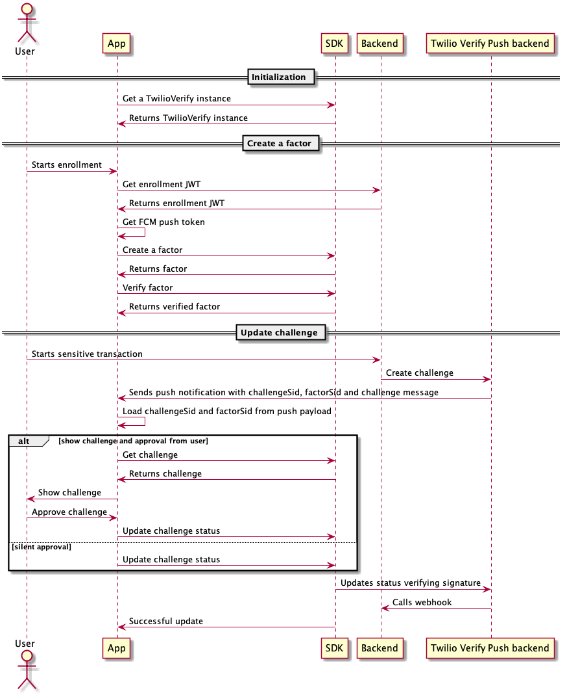

# Twilio Verify Android

## Table of Contents

* [About](#About)
* [Dependencies](#Dependencies)
* [Requirements](#Requirements)
* [Definitions](#Definitions)
* [Installation](#Installation)
* [Usage](#Usage)
* [Running the Sample app](#SampleApp)
* [Running the sample backend](#SampleBackend)
* [Using the sample app](#UsingSampleApp)

<a name='About'></a>

## About
Verify Push enables developers to implement secure push authentication without giving up privacy and control. This project provides a SDK to create and use verify push

<a name='Dependencies'></a>

## Dependencies

None

<a name='Requirements'></a>

## Requirements
* Android Studio 3.6 or higher
* Java 8
* Android 6.0 (23) SDK or higher
* Gradle 5.6.4
* Kotlin 1.3.72

<a name='Definitions'></a>

## Definitions

* `Service`: Scope the resources. It contains the configurations for each factor
* `Entity`: Represents anything that can be authenticated in a developer’s application. Like a User
* `Factor`: It is an established method for sending authentication Challenges. Like SMS, Phone Call, Push
* `Challenge`: It is a verification attempt sent to an Entity |

<a name='Installation'></a>

## Installation

### Add library
In the build.gradle file, add the library

```implementation 'com.twilio:twilio-verify-android:0.0.1'```

### Add firebase configuration
If you want to receive challenges as push notifications, you should add a firebase configuration to your project
* Add a project in Firebase to use cloud messaging for an application ID
* Add the google-services.json file to your project

More info [here](https://firebase.google.com/docs/android/setup#console)

<a name='Usage'></a>

## Usage

### Flow



### Get a TwilioVerify instance

#### Kotlin
```Kotlin
val twilioVerify = TwilioVerify.Builder(applicationContext).build()
```
[Full source](sample/src/main/java/com/twilio/verify/sample/kotlin/TwilioVerifyKotlinAdapter.kt#L36)

#### Java
```Java
TwilioVerify twilioVerify = new TwilioVerify.Builder(applicationContext).build();
```
[Full source](sample/src/main/java/com/twilio/verify/sample/java/TwilioVerifyJavaProvider.java#L26)

### Create a factor

#### Kotlin
```Kotlin
val factorInput = PushFactorInput(factorName, serviceSid, entityIdentity, pushToken, enrollmentJwe)
twilioVerify.createFactor(factorInput, { factor ->
  // Success
}, { exception ->
  // Error
})
```
[Full source](sample/src/main/java/com/twilio/verify/sample/kotlin/TwilioVerifyKotlinAdapter.kt#L121)

#### Java
```Java
FactorInput factorInput = new PushFactorInput(factorName, serviceSid, entityIdentity, pushToken, enrollmentJwe);
twilioVerify.createFactor(factorInput,
  new Function1<Factor, Unit>() {
    @Override public Unit invoke(Factor factor) {
      // Success
      return Unit.INSTANCE;
    }
  }, 
  new Function1<TwilioVerifyException, Unit>() {
    @Override public Unit invoke(TwilioVerifyException error) {
      // Error
      return Unit.INSTANCE;
    }
  });
```
[Full source](sample/src/main/java/com/twilio/verify/sample/java/TwilioVerifyJavaAdapter.java#L89)

### Verify a factor

#### Kotlin
```Kotlin
val verifyFactorInput = VerifyPushFactorInput(factorSid)
twilioVerify.verifyFactor(verifyFactorInput, { factor ->
  // Success
}, { exception ->
  // Error
})
```
[Full source](sample/src/main/java/com/twilio/verify/sample/kotlin/TwilioVerifyKotlinAdapter.kt#L114)

#### Java
```Java
VerifyFactorInput verifyFactorInput = new VerifyPushFactorInput(factorSid);
twilioVerify.verifyFactor(verifyFactorInput,
  new Function1<Factor, Unit>() {
    @Override public Unit invoke(Factor factor) {
      // Success
      return Unit.INSTANCE;
    }
  }, 
  new Function1<TwilioVerifyException, Unit>() {
    @Override public Unit invoke(TwilioVerifyException error) {
      // Error
      return Unit.INSTANCE;
    }
  });
```
[Full source](sample/src/main/java/com/twilio/verify/sample/java/TwilioVerifyJavaAdapter.java#L57)

### Get a challenge

#### Kotlin
```Kotlin
twilioVerify.getChallenge(challengeSid, factorSid, { challenge ->
  // Success
}, { exception ->
  // Error
})
```
[Full source](sample/src/main/java/com/twilio/verify/sample/viewmodel/ChallengeViewModel.kt#L21)

#### Java
```Java
twilioVerify.getChallenge(challengeSid, factorSid,
  new Function1<Challenge, Unit>() {
    @Override public Unit invoke(Challenge challenge) {
      // Success
      return Unit.INSTANCE;
    }
  }, 
  new Function1<TwilioVerifyException, Unit>() {
    @Override public Unit invoke(TwilioVerifyException error) {
      // Error
      return Unit.INSTANCE;
    }
  });
```
[Full source](sample/src/main/java/com/twilio/verify/sample/java/TwilioVerifyJavaAdapter.java#L74)

### Update a challenge

#### Kotlin
```Kotlin
val updateChallengeInput =  UpdatePushChallengeInput(factorSid, challengeSid, newStatus)
twilioVerify.updateChallenge(updateChallengeInput, {
  // Success
}, { exception ->
  // Error
})
```
[Full source](sample/src/main/java/com/twilio/verify/sample/viewmodel/ChallengeViewModel.kt#L36)

#### Java
```Java
UpdateChallengeInput updateChallengeInput =  new UpdatePushChallengeInput(factorSid, challengeSid, newStatus);
twilioVerify.updateChallenge(challengeSid, factorSid,
  new Function0<Unit>() {
    @Override
    public Unit invoke() {
      // Success
      return Unit.INSTANCE;
    }
  }, 
  new Function1<TwilioVerifyException, Unit>() {
    @Override public Unit invoke(TwilioVerifyException error) {
      // Error
      return Unit.INSTANCE;
    }
  });
```
[Full source](sample/src/main/java/com/twilio/verify/sample/java/TwilioVerifyJavaAdapter.java#L63)

### Get challenges

#### Kotlin
```Kotlin
val challengeListInput = ChallengeListInput(factorSid, pageSize, status, pageToken)
twilioVerify.getAllChallenges(challengeListInput, { challenges ->
  // Success
}, { exception ->
  // Error
})
```
[Full source](sample/src/main/java/com/twilio/verify/sample/viewmodel/ChallengesViewModel.kt#L19)

#### Java
```Java
ChallengeListInput challengeListInput = new ChallengeListInput(factorSid, pageSize, status, pageToken);
twilioVerify.getAllChallenges(challengeListInput, 
  new Function1<ChallengeList, Unit>() {
    @Override public Unit invoke(ChallengeList challengeList) {
      // Success
      return Unit.INSTANCE;
    }
  }, 
  new Function1<TwilioVerifyException, Unit>() {
    @Override public Unit invoke(TwilioVerifyException error) {
      // Error
      return Unit.INSTANCE;
    }
  });
```
[Full source](sample/src/main/java/com/twilio/verify/sample/java/TwilioVerifyJavaAdapter.java#L136)

### Update a factor

If the push token changes, you should update the factors to use the new push token

#### Kotlin
```Kotlin
val updateFactorInput = UpdatePushFactorInput(factorSid, newPushToken)
twilioVerify.updateFactor(updateFactorInput, { factor ->
  // Success
}, { exception ->
  // Error
})
```
[Full source](sample/src/main/java/com/twilio/verify/sample/kotlin/TwilioVerifyKotlinAdapter.kt#L105)

#### Java
```Java
UpdateFactorInput updateFactorInput = UpdatePushFactorInput(factorSid, newPushToken);
twilioVerify.updateFactor(updateFactorInput,
  new Function1<Factor, Unit>() {
    @Override public Unit invoke(Factor factor) {
      // Success
      return Unit.INSTANCE;
    }
  }, 
  new Function1<TwilioVerifyException, Unit>() {
    @Override public Unit invoke(TwilioVerifyException error) {
      // Error
      return Unit.INSTANCE;
    }
  });
```
[Full source](sample/src/main/java/com/twilio/verify/sample/java/TwilioVerifyJavaAdapter.java#L151)

<a name='SampleApp'></a>

## Running the Sample app

### To run the Sample App:
* Clone the repo
* Follow the steps from [Firebase configuration](#FirebaseConfiguration)
* Get the Enrollment JWE generation URL from your backend [(Running the Sample backend)](#SampleBackend)
* Replace the `ENROLLMENT_URL` (Enrollment JWE generation URL, including the path) in the sample's build.gradle file for [release build type](sample/build.gradle#L30)
* Run the `sample` module using `release` as build variant

<a name='FirebaseConfiguration'></a>

### Firebase configuration

In order to run the sample app, you have to create a project and application in Firebase
* Add a project in Firebase to use cloud messaging for an application ID (you can use `com.twilio.verify.sample`)
* Move the google-services.json file you downloaded from Firebase console into the root of `sample` directory.

<a name='SampleBackend'></a>

## Running the Sample backend

### Create a Notify service
You will need a notify service to send push notifications to your app
* Go to [Push Credentials](https://www.twilio.com/console/notify/credentials)
* Click the `Add (+)` button 
* Enter a friendly name
* Select `FCM push credentials` as type
* Enter the `FCM Secret`. The value is the app's `Server key`. You can find it in your app's Firebase project settings, Cloud messaging
* Click the `Create` button
* Go to [Notify Services](https://www.twilio.com/console/notify/services)
* Create a `Notify service` for the app
* For `FCM CREDENTIAL SID`, select the created FCM credential
* Save changes
* Copy the notify service sid

### Create a verify service
* Get your account Sid and Auth Token from [API credentials](https://www.twilio.com/console/project/settings)
* Create a verify service calling the endpoint:
```
curl -X POST https://verify.twilio.com/v2/Services \
--form 'FriendlyName=Your service name' \
--form 'Push={
    "notify_service_sid": "IS00000000000000000000000000000000"
  }' \
-u ACXXXXXXXXXXXXXXXXXXXXXXXXXXXXXXXX:your_auth_token
```
* Copy the verify service Sid, it is the `sid` field in the response

### To run the sample backend
* Clone this repo: https://github.com/twilio/verify-push-sample-backend
* Run the steps in the [README file](https://github.com/twilio/verify-push-sample-backend/blob/master/README.md)
    * Use your previously created verify service Sid for `TWILIO_VERIFY_SERVICE_SID`

<a name='UsingSampleApp'></a>

## Using the sample app

### Adding a factor
* Press Create factor in the factor list (main view)
* Enter the entity identity to use. This value should be an UUID that identifies the user to prevent PII information use
* Press Create factor
* Copy the factor Sid

### Sending a challenge
* Go to Create Push Challenge page (/challenge path in your sample backend)
* Enter the entity `identity` you used in factor creation
* Enter the `Factor Sid` you added
* Enter a `message`. You will see the message in the push notification and in the challenge view
* Enter details to the challenge. You will see them in the challenge view. You can add more details using the `Add more Details` button
* Press `Create challenge` button
* You will receive a push notification showing the challenge message in your device. 
* The app will show the challenge info below the factor information, in a `Challenge` section
* Approve or deny the challenge
* After the challenge is updated, you will see the challenge status in the backend's `Create Push Challenge` view

